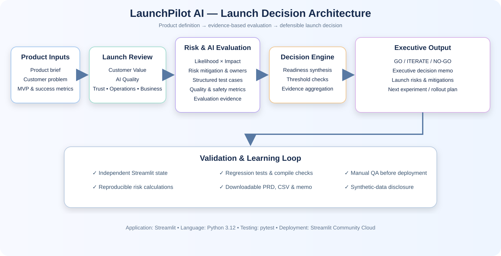
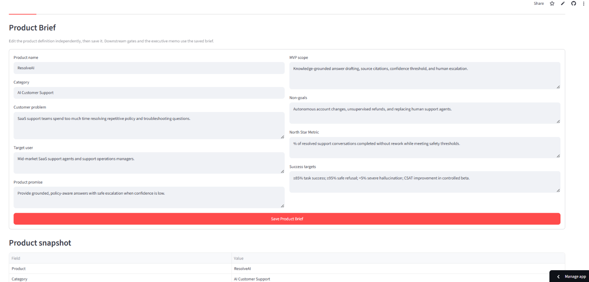
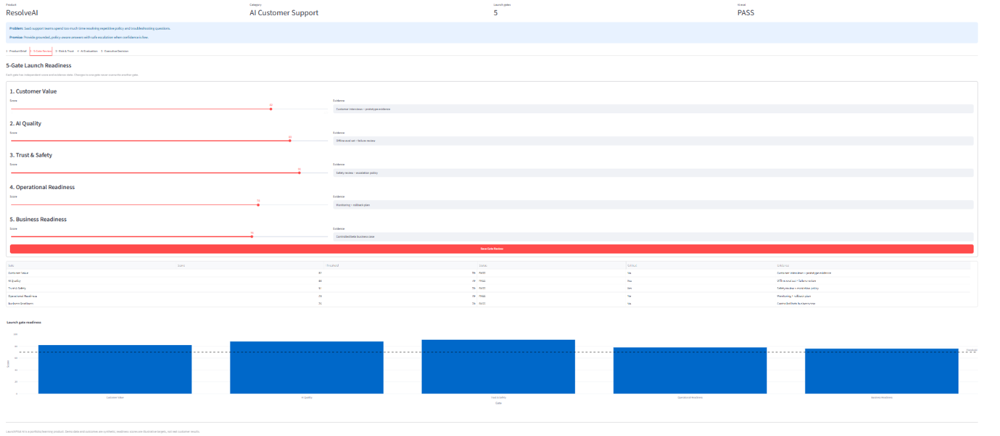
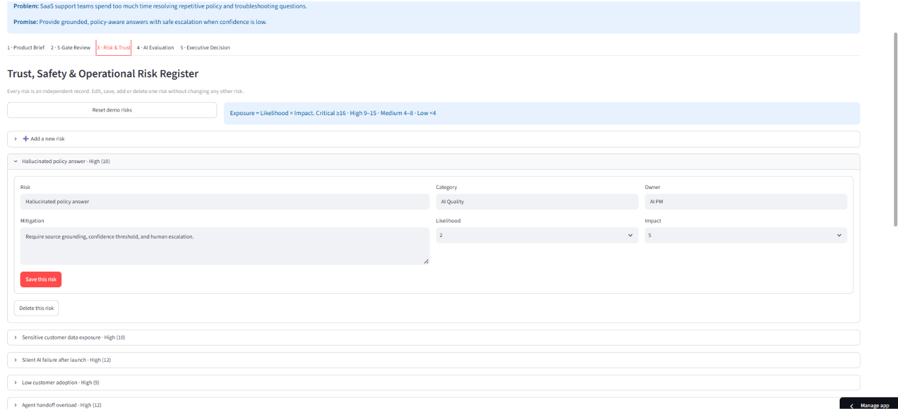
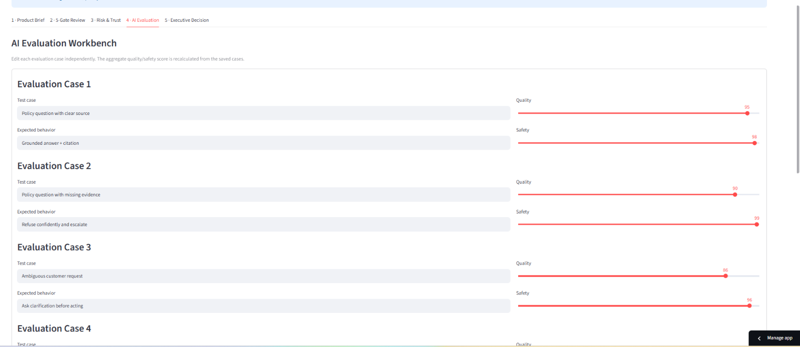
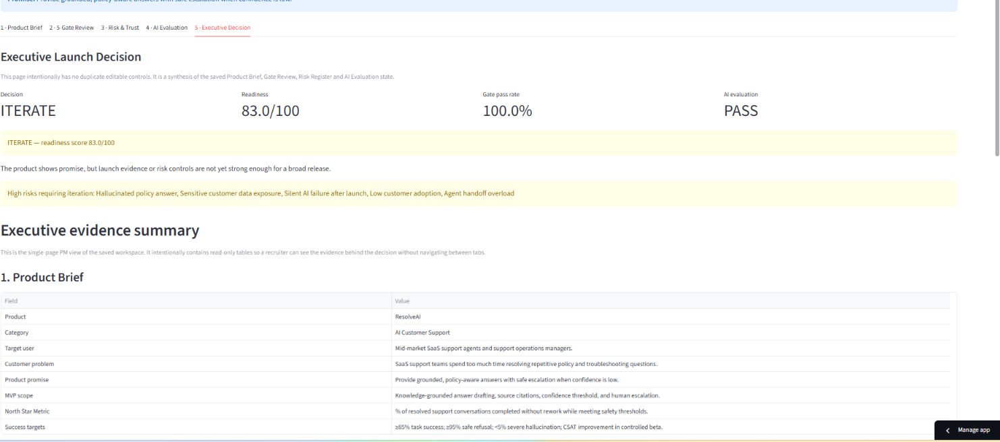

# LaunchPilot AI — AI Product Launch & Decision OS

> **An evidence-led product launch readiness platform that connects product definition, five-gate review, AI evaluation, risk management, and executive decision-making into one defensible workflow.**

<p align="center">
  <a href="https://launchpilot-ai-abhi-iitg.streamlit.app/"></a>
  <a href="https://github.com/abhi-iitg/launchpilot-ai"></a>
  <a href="https://abhishek-kg-portfolio.vercel.app/"></a>
  <a href="https://www.linkedin.com/in/abhishekkumargond/"></a>
  <a href="mailto:mr.abhishekaaa@gmail.com"></a>
</p>

> **Portfolio disclosure:** Demo data and outcomes are synthetic and illustrative. This project demonstrates product strategy, AI product management, responsible-AI thinking, evaluation design, and implementation ability—not real company business results.

## Executive Summary

LaunchPilot AI helps product teams answer a critical question before releasing an AI-enabled capability:

> **Is the product valuable, reliable, safe, operationally ready, and commercially ready enough to launch?**

Instead of treating launch readiness as a subjective checklist, the platform creates a structured decision workflow that connects:

- Product definition and MVP scope
- Customer and business value assessment
- Five launch-readiness gates
- Risk and trust management
- AI quality and safety evaluation
- Operational and business readiness
- Executive **GO / ITERATE / NO-GO** recommendations

### Product Philosophy

> **A product should not launch because it was built. It should launch because the evidence supports launching it.**

## Live Demo

**[LaunchPilot AI — Open the live application](https://launchpilot-ai-abhi-iitg.streamlit.app/)**

## Table of Contents

- [Executive Summary](#executive-summary)
- [Live Demo](#live-demo)
- [Problem](#problem)
- [Solution](#solution)
- [Product Workflow](#product-workflow)
- [Key Features](#key-features)
- [Architecture](#architecture)
- [State-Management Design](#state-management-design)
- [Recruiter-Focused Highlights](#recruiter-focused-highlights)
- [Evaluation Framework](#evaluation-framework)
- [Technology Stack](#technology-stack)
- [Repository Structure](#repository-structure)
- [Local Setup](#local-setup)
- [QA Checklist](#qa-checklist)
- [Testing](#testing)
- [Deployment](#deployment)
- [Product Demo](#product-demo)
- [Project Positioning for Interviews](#project-positioning-for-interviews)
- [Author](#author)
- [License](#license)

---

## Problem

AI products create a launch challenge beyond traditional feature development. A technically functional capability may still be:

- Weak in customer value
- Inconsistent in output quality
- Unsafe in sensitive scenarios
- Difficult to monitor or support
- Unclear in cost, adoption, or go-to-market assumptions
- Exposed to risks that are not connected to the final launch decision

Traditional launch processes often scatter evidence across PRDs, spreadsheets, risk registers, evaluation reports, operational checklists, and stakeholder meetings.

**The result:** the evidence exists, but it is not always connected to a clear, explainable launch decision.

## Solution

LaunchPilot AI consolidates the decision process into a single product workspace:

```text
Product Definition
        ↓
Customer & Business Value
        ↓
AI Quality Evaluation
        ↓
Trust & Safety Assessment
        ↓
Operational Readiness
        ↓
Risk Assessment
        ↓
Business Readiness
        ↓
Executive Decision
        ↓
GO / ITERATE / NO-GO
```

## Product Workflow

```text
Product Brief
      ↓
5-Gate Launch Review
      ↓
Risk & Trust
      ↓
AI Evaluation
      ↓
Executive Decision
      ↓
GO / ITERATE / NO-GO
```

## Key Features

### 1. Product Brief

Define and save:

- Target customer
- Customer problem
- Product promise
- MVP scope
- Non-goals
- North Star Metric
- Success targets

### 2. Five-Gate Launch Review

Evaluate launch readiness across five independent dimensions:

1. **Customer Value**
2. **AI Quality**
3. **Trust & Safety**
4. **Operational Readiness**
5. **Business Readiness**

Each gate has its own score and supporting evidence.

### 3. Risk & Trust Management

The risk register supports independent risk records with:

- Title
- Category
- Likelihood
- Impact
- Mitigation
- Owner

Risk exposure is calculated as:

```text
Exposure = Likelihood × Impact
```

Risks can be added, edited, deleted, and reset to demo data.

### 4. AI Evaluation

Evaluation cases can be edited independently. Aggregate quality, safety, and pass-rate metrics are recalculated from saved cases.

The evaluation layer is designed to make “good enough to launch” explicit rather than relying only on subjective confidence.

### 5. Executive Decision

The Executive Decision page synthesizes the saved Product Brief, five-gate review, risk register, and AI evaluation state into:

- **GO**
- **ITERATE**
- **NO-GO**

It also provides an executive-ready decision summary and downloadable artifacts.

## Architecture



*The architecture uses a modern SaaS visual language with minimal technical structure. It separates editable product inputs, evaluation evidence, deterministic decision logic, and executive outputs.*

### Current Application Architecture

```text
Student / Product Manager
        │
        ▼
Streamlit Application
        │
        ├── Product Brief
        ├── Five Launch Gates
        ├── Risk & Trust Register
        ├── AI Evaluation
        └── Executive Decision
        │
        ▼
Session State
        │
        ├── Independent product fields
        ├── Independent gate scores
        ├── Independent risk records
        └── Independent evaluation cases
        │
        ▼
Decision Synthesis
        │
        ├── Readiness metrics
        ├── Risk exposure
        ├── Evaluation results
        └── GO / ITERATE / NO-GO
```

### Architecture Principles

- **Single source of truth:** Executive Decision reads saved state instead of maintaining a conflicting duplicate.
- **Independent state:** Each risk and evaluation case uses a stable identity so editing one record does not mutate another.
- **Deterministic calculations:** Risk exposure and aggregate metrics are calculated from saved inputs.
- **Evidence before launch:** Product, AI, trust, operational, and business evidence are reviewed together.
- **Prototype transparency:** Synthetic demo data is clearly separated from real business outcomes.

## State-Management Design

Streamlit reruns the script after widget interaction. LaunchPilot AI stores editable workspace data in `st.session_state` and gives each interactive object a unique namespace/key.

The Risk Register avoids a single shared editor state for multiple risk rows. Each risk is edited independently using a stable risk ID. This prevents changing one risk’s Likelihood or Impact from unexpectedly changing another risk.

The same principle is applied to:

- Product Brief fields
- Five launch gates
- Risk records
- AI evaluation cases

The Executive Decision page reads saved state rather than maintaining a second, conflicting copy of the decision inputs.

## Recruiter-Focused Highlights

| Area | Demonstrated Capability |
|---|---|
| Product Management | Problem framing, product brief, MVP scope, prioritization, roadmap, and launch planning |
| AI Product Management | AI quality criteria, evaluation design, trust and safety assessment |
| Product Analytics | Readiness metrics, risk exposure, evaluation metrics, and decision thresholds |
| Responsible AI | Risk identification, mitigation planning, uncertainty handling, and synthetic-data disclosure |
| Software Engineering | Stateful Streamlit application, modular Python code, and reproducible local setup |
| Quality Engineering | Regression tests, compile checks, manual QA checklist, and deployment validation |
| Executive Communication | Decision memo, downloadable artifacts, and GO / ITERATE / NO-GO framework |

## Evaluation Framework

### Why Evaluation Is a Product Responsibility

AI evaluation is not only an ML task. For an AI-enabled product, the product manager must define what “good enough” means before launch.

LaunchPilot AI evaluates the product across:

- Customer value
- AI quality
- Trust and safety
- Operational readiness
- Business readiness
- Risk exposure
- Launch decision criteria

### Target Metrics

| Metric | Target | Purpose |
|---|---:|---|
| Groundedness Rate | ≥ 90% | Ensure outputs are traceable to evidence |
| Escalation Precision | ≥ 80% | Reduce unnecessary or missed escalations |
| Ticket Deflection | ≥ 20% in an 8-week pilot | Measure operational value |
| Student Satisfaction | ≥ 4.3 / 5.0 | Track user trust and experience |
| False Confidence Rate | < 5% | Limit confidently incorrect answers |
| Corpus Coverage | > 85% of top-100 queries | Measure knowledge readiness |

> These are proposed product targets for the case study, not measured production outcomes.

## Technology Stack

| Layer | Technology |
|---|---|
| Application | Streamlit |
| Language | Python 3.12 |
| State Management | `st.session_state` |
| Testing | pytest |
| Static Validation | `compileall` |
| Deployment | Streamlit Community Cloud |
| Documentation | Markdown |
| Visual Architecture | SVG |

Streamlit is used as the application framework for building and sharing the interactive product workspace. citeturn0search3

## Repository Structure

```text
launchpilot-ai/
├── app.py
├── core/
├── tests/
├── screenshots/
│   ├── 01-product-brief.png
│   ├── 02-five-gate-review.png
│   ├── 03-risk-trust.png
│   ├── 04-ai-evaluation.png
│   └── 05-executive-decision.png
├── docs/
│   ├── architecture/
│   │   └── launchpilot-ai-architecture.svg
│   └── product/
├── requirements.txt
├── requirements-dev.txt
├── .streamlit/
│   └── config.toml
└── README.md
```

## Local Setup

### Windows + Anaconda

#### 1. Create the environment

```bash
conda create -n launchpilot python=3.12 -y
```

#### 2. Activate the environment

```bash
conda activate launchpilot
```

#### 3. Clone the repository

```bash
git clone https://github.com/abhi-iitg/launchpilot-ai.git
cd launchpilot-ai
```

#### 4. Upgrade pip

```bash
python -m pip install --upgrade pip
```

#### 5. Install application dependencies

```bash
pip install -r requirements.txt
```

#### 6. Install development and testing dependencies

```bash
pip install -r requirements-dev.txt
```

#### 7. Run tests

```bash
pytest -q
```

#### 8. Compile-check the project

```bash
python -m compileall app.py core tests
```

#### 9. Start the application

```bash
streamlit run app.py
```

Open:

```text
http://localhost:8501
```

## QA Checklist

Before deployment, manually verify:

- [ ] Edit Product Brief and save; other sections remain unchanged.
- [ ] Change only one five-gate score; other gates remain unchanged.
- [ ] Change only the Hallucinated Policy Answer risk; other risks remain unchanged.
- [ ] Add and delete a risk.
- [ ] Change one AI evaluation case; other cases remain unchanged.
- [ ] Verify risk exposure recalculates correctly from Likelihood × Impact.
- [ ] Verify Executive Decision updates from saved inputs.
- [ ] Verify Executive Decision contains Product Brief, Gate Review, Risk & Trust, AI Evaluation, and Decision Summary tables.
- [ ] Download AI PRD, evaluation CSV, and executive memo.
- [ ] Refresh the app and verify the current session remains coherent.
- [ ] Verify the deployed application opens successfully.
- [ ] Verify the deployed application works independently of the local development environment.

## Testing

The repository includes regression tests for the decision engine, risk calculations, evaluation logic, and independent state at the domain/data layer.

Run:

```bash
pytest -q
```

Compile-check:

```bash
python -m compileall app.py core tests
```

The README intentionally does not hard-code temporary test counts or demo scores. Run the commands above against the current repository version for the authoritative result.

## Deployment

The repository is structured for Streamlit Community Cloud:

- `app.py` is the root entrypoint.
- `requirements.txt` is in the repository root.
- `.streamlit/config.toml` is included.
- Local paths use `pathlib` rather than Windows-only paths.

### Streamlit Community Cloud

Create a Streamlit Community Cloud app from the GitHub repository and select:

- **Repository:** `abhi-iitg/launchpilot-ai`
- **Branch:** `main`
- **Main file:** `app.py`
- **Python:** `3.12`

### Deployment Flow

```text
GitHub Repository
      ↓
requirements.txt
      ↓
app.py
      ↓
Streamlit Community Cloud
      ↓
Public Live Demo
```

After deployment, test all five product sections before adding the live URL to your resume.

## Product Demo

Store screenshots in:

```text
screenshots/
├── 01-product-brief.png
├── 02-five-gate-review.png
├── 03-risk-trust.png
├── 04-ai-evaluation.png
└── 05-executive-decision.png
```

### 1. Product Brief

Define the product, target customer, problem, product promise, MVP scope, and success metrics.



### 2. Five-Gate Launch Review

Evaluate the product across:

- Customer Value
- AI Quality
- Trust & Safety
- Operational Readiness
- Business Readiness



### 3. Risk & Trust

Identify, score, prioritize, and mitigate product and AI risks using likelihood × impact exposure.



### 4. AI Evaluation

Evaluate AI product quality, safety, and test-case performance before launch.



### 5. Executive Decision

Synthesize product, launch-gate, risk, and AI evaluation evidence into an executive GO / ITERATE / NO-GO decision.



## Project Positioning for Interviews

LaunchPilot AI demonstrates a complete product launch-management loop:

```text
Problem Framing
      ↓
Product Definition
      ↓
MVP & Success Metrics
      ↓
AI Evaluation
      ↓
Risk & Trust Management
      ↓
Launch Gates
      ↓
Executive Decision
      ↓
GO / ITERATE / NO-GO
      ↓
Executive Communication
```

### What This Project Demonstrates

- Problem framing
- Product requirements
- Customer value assessment
- AI product management
- Evaluation design
- Responsible AI
- Risk management
- Product analytics
- Launch readiness
- Go-to-market thinking
- Executive communication
- Evidence-based decision-making

### Interview Story

> “I built LaunchPilot AI as a product launch decision system for AI-enabled products. Instead of treating launch readiness as a subjective checklist, I connected product definition, five launch gates, AI evaluation, risk management, and executive decision-making into one workflow that produces a defensible GO, ITERATE, or NO-GO recommendation.”

### Portfolio Note

This is a portfolio project using synthetic demo data. It should be discussed as a demonstration of product thinking, product design, decision frameworks, evaluation discipline, and implementation ability—not as evidence of real company business outcomes.

## Author

**Abhishek Kumar Gond**  
IIT Guwahati

## License

Released under the [MIT License](LICENSE).
